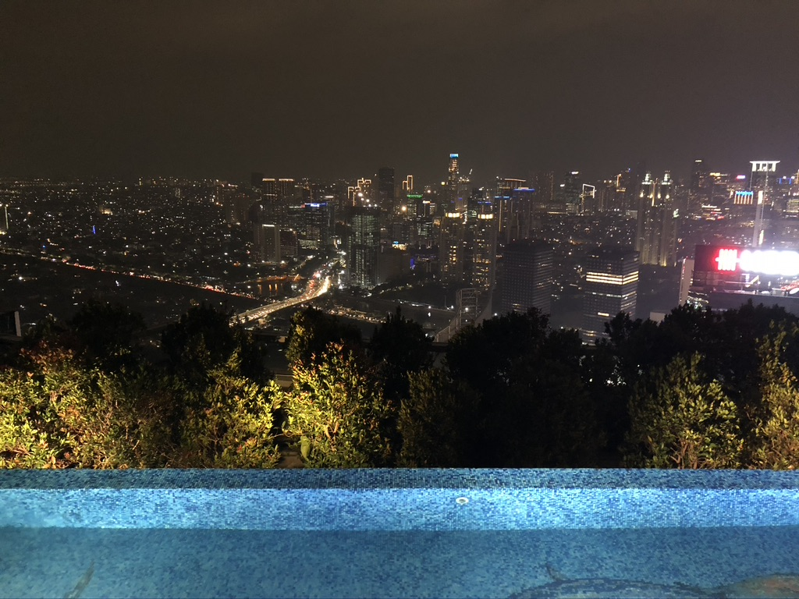

동남아시아의 많은 대도시를 다녀보진 않았지만, 대체로 몰(mall)이 발달했다. 이번에 자카르타를 방문해서도 모든 식사와 쇼핑은 몰에서 해결했다. 10년전에 방문했던 방콕도 그랬다. 전철역에 내리면 몰(mall)로 직접 이동할수 있게 통로로 연결되어 있었다. 건물들 사이에도 군데군데 연결 통로가 있어 굳이 바깥으로 나갈 필요가 없었다. 아마 더운 날씨 탓이리라. 1년 내내 덥고 습하기 때문에 최대한 바깥을 피하기 위함이 아니었을까? 관광하는 입장에서는 진짜 편했다. 더운 날씨에 굳이 바깥에 나가지 않아도 시원한 에어컨 바람을 맞으며 실내에서 모든걸 해결할 수 있었으니까.

`몰(mall)`이라는 거대한 폐쇄적 도시는 21세기부터 급속히 발달하기 시작했다. 세계 어느 도시든 상관없었다. 전세계적으로 몰이라는 형태의 대형 쇼핑센터가 우후죽순으로 만들어졌다. 동남아도 마찬가지였다. 세계의 변화 흐름에 맞춰 외국의 거대 자본이 도시에 몰을 지어댔다. 이미 많이 발달한 선진국 대도시에서는 도심에 몰을 지을 자리가 별로 없었다. 그래서 변두리를 중심으로 몰이 들어섰다. 반면에 동남아의 대도시에는 도심 곳곳에 대규모 몰이 만들어졌다. 상대적으로 발달이 늦은 동남아에는 몰을 짓기 위한 공간이 충분했기 때문이었다. 동남아와 몰은 최적의 궁합이었다. 동남아 대부분은 덥고 습하고 우기에는 비도 많이 내린다. 이런 환경에서 1년 내내 시원하고 쾌적환 환경에서 식사와 쇼핑, 엔터테인먼트를 모두 즐길 수 있는 몰은 최고의 공간이었다. 길거리 상점이나 전통 시장은 관광차원에서 한번쯤 들릴수 있을지 몰라도 더이상 일상적으로 드나들만한 공간은 아니었다. 위생적으로도 한참 뒤 떨어진 곳에서 누가 굳이 먹을거리를 사먹을까. 임금 높은 회사원들, 관광객들은 이제 몰에서 모든걸 해결한다.

이번에 다녀온 `자카르타`도 마찬가지였다. 점심, 저녁은 모두 몰에서 해결했다. 만약 오피스 앞에 스타벅스가 없었더라면 커피 한잔을 사기 위해서라도 몰로 갔어야 했을것이다. 사실 오피스에서 몰은 그리 멀지 않다. 직선거리로 200m 정도 밖에 안된다. 물론 사이에 도로가 하나 있긴 하지만 몰로 가기 위해 굳이 도로를 건널 필요는 없다. 오피스에서 몰까지 연결된 연결통로를 따라가면 된다. 직선 거리는 200m 밖에 안되지만 연결통로를 통하면 조금 더 멀다. 실은 바깥도 잘 안보이고 층을 오르내려야하기 때문에 훨씬 멀게 느껴진다. 하지만, 자카르타에서는 이게 최선이다. 날씨도 덥고 도로 환경도 최악이기 때문이다. 자카르타에서 길을 건넌다는게 얼마나 큰 허들인지는 직접 겪어보지 않은 사람들은 절대 알 수 없다.

몰과 연결 통로는 강한 햇빛과 공해를 막아주는 고마운 존재다. 하지만, 어떤 사람들에게는 전혀 아니다. 몰과 연결통로가 나쁜 환경을 막아주고 사람들에게 편리함을 제공하는건 사실이다. 하지만 몰은 몰과 몰이 아닌 곳으로 도시를 단절시킨다. 몰이 발달하고 몰 접근성이 확대되면서 사람들은 더이상 길거리로 다니지 않게 되었다. 현지 사람들이 아닌 이상 대부분 몰로 향했다. 몰의 발달과 동시에 몰 주변은 상대적으로 더 소외되었다. 길거리에도 상점이 있지만 대부분 현지 사람들만 찾는다. 출장온 사람이나 관광객은 거의 없다. 나도 일주일가량 출장을 다녀왔지만, 길거리 상점을 이용한적은 단 한번도 없었다. 그래서 내가 자카르타를 다녀온건지 쇼핑몰을 다녀온건지 헷갈릴정도다. 자카르타 현지라는 느낌을 받은적은 그랩을 타고 이동하면서 바깥을 바라볼 때 뿐이었다.

`편리함`이라는 측면에서는 확실히 몰이 좋다. 하지만 몰이 만든 도시와의 단절 때문에 많은 사람이 몰에서 소외되었다. 길거리 상점이나 길거리 음식점들. 다니는 사람이 없기 때문에 장사가 잘 될리 없다. 몰은 그들에게서 그들의 생업을 빼앗아갔다. 생업을 빼앗긴 사람들은 빈곤하다. 도시는 점점 발전하는데 사람들의 빈곤은 나아질 기미가 없다. 모두가 몰로 향하기 때문이다. 실제로 인도네시아의 빈곤율은 15년째 줄어들지 않고 있다고 한다. `팩트풀니스`에서 얘기했듯이 전세계의 빈곤율이 급격히 줄어들고 있는 상황에서 말이다.

  &#60;사진에 속지말자. 아마 자카르타에서 가장 아름다운 풍경 중 하나일 것이다.&#62;

또한 자카르타에는 `오토바이`가 너무 많다. 베트남 만큼은 아니라고 하는데, 베트남에 가본일이 없으니 잘 모르겠다. 아무튼 오토바이가 너무 많아서 공해가 심각하다. 그리고 사람이 걸어다닐만한 공간이 거의 없다. 어딘가 가려고 하면 대부분의 사람들은 오토바이를 타거나 그랩(Grab)을 이용할 수 밖에 없다. 숙소에서 오피스가 불과 700m 정도 밖에 떨어져 있지 않았지만, 출근하기 위해 매일 아침 그랩을 호출해야 했다. 인드네시아는 과거에 법이 체계적이지 않았고 엄격하지 않았기 때문에 부폐가 심했다 한다. 부페는 극심한 난개발을 낳았고, 결국 도시가 망가졌다.

자카르타는 교통만이 문제가 아니다. 자카르타(Jakarta)는 점차 가라앉고 있다. 앞으로 30년 후면 북부 자카르타의 대부분이 가라앉는다고 한다. 가장 큰 이유는 무분별한 지하수 사용으로 인한 지반침하. 60%가 넘는 사람들이 지하수에만 의존한다. 또한 정부의 규제가 약한 틈을 타 대규모 빌딩도 불법으로 지하수를 끌어 쓴다는게 밝혀졌다. 최근 인도네시아 정부가 보르네오 섬 동칼리만탄으로 수도를 이전하기로 결정했는데, 이런 도시 문제들을 해결하기 불가능하다 판단했기 때문일 것이다(물론 다양한 정치적 이유도 있겠지만...).

자카르타로 출장다녀온게 그다지 유쾌한 경험은 아니었다. 몰로인한 단절, 빈부격차,교통체증, 환경오염, 가라앉는 도시. 진짜 암울하다. 얼마나 도시 문제가 심각했으면 수도 이전이라는 초강수를 두게 되었을까?
